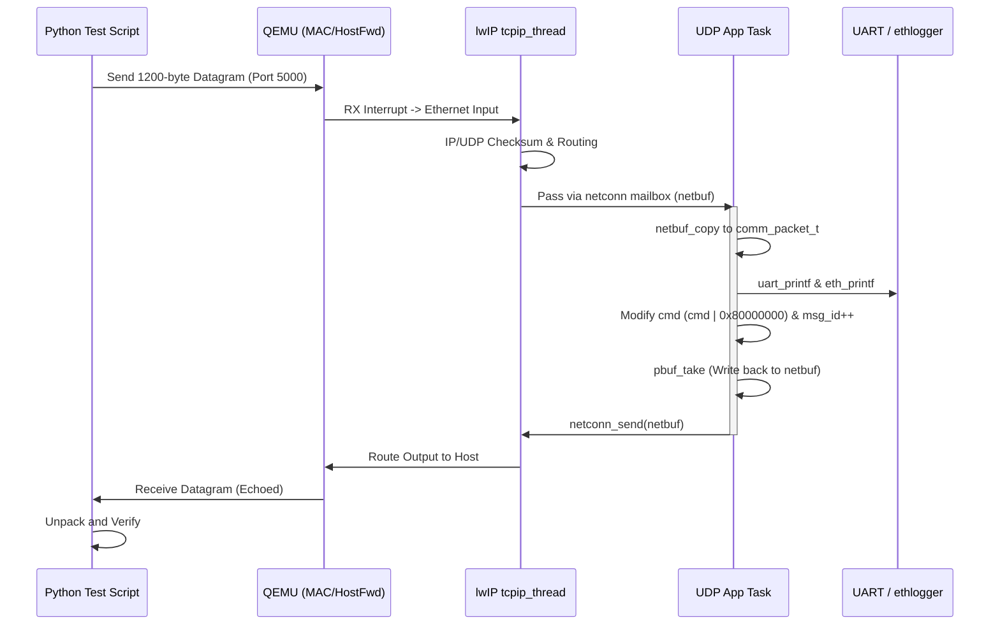
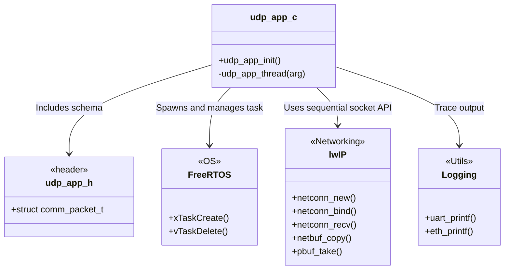
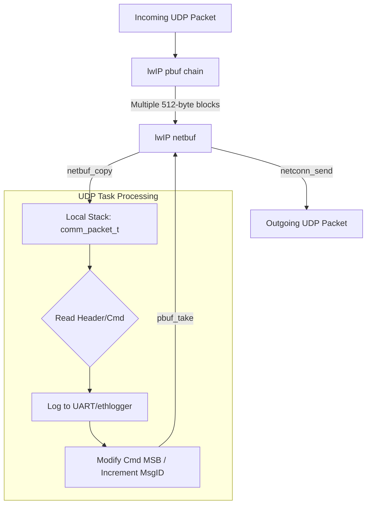

# UDP Application Architecture

This document describes the architecture, dependencies, and testing methodology for the `udp_app` module implemented in the QEMU Cortex-M3 emulator firmware.

## Overview

The `udp_app` is a dedicated FreeRTOS task that implements a basic, structured communication stack over UDP. Instead of raw string parsing, it enforces a rigid 1200-byte C-style structure (`comm_packet_t`) to ensure deterministic memory bounds and eliminate standard MTU IP fragmentation risks over the internal networking bridges.

---

## 1. FreeRTOS Integration

The application heavily utilizes FreeRTOS to operate concurrently with the rest of the system (Shell, TCP/IP networking, Logging).

### Components Used
- **Task Creation (`xTaskCreate`)**: The UDP server runs in its own task (`udp_app_thread`).
- **Priority Management**: It is assigned `tskIDLE_PRIORITY + 2`. This ranks it below the core `tcpip_thread` but above the user `ShellTask`, ensuring timely processing of incoming network streams.
- **Task Management**: Uses `vTaskDelete(NULL)` to cleanly terminate the task if the lwIP sockets fail to initialize.

---

## 2. lwIP Integration

The application bypasses the raw PCB API in favor of lwIP's thread-safe sequential API to ensure it safely operates alongside other network-heavy tasks (like Telnet).

### Components Used
- **Netconn API (`lwip/api.h`)**:
  - `netconn_new(NETCONN_UDP)`: Creates a UDP connection block.
  - `netconn_bind(...)`: Binds the socket to `IP_ADDR_ANY` on port `5000`.
  - `netconn_recv(...)`: Blocks the FreeRTOS task efficiently until a packet arrives.
  - `netconn_send(...)`: Used to echo the processed response back to the sender.
- **Netbuf API**:
  - `netbuf_len(...)`: Computes the total length of the fragmented packet.
  - `netbuf_copy(...)`: **Crucial Operation.** Since lwIP chains incoming packets across multiple 512-byte `pbuf` allocations, this function is used to safely extract the full 1200 bytes into the local `comm_packet_t` struct.
  - Address extraction macros: `netbuf_fromaddr` and `netbuf_fromport`.
- **Pbuf API (`pbuf_take`)**: After modifying the command fields to indicate a response, the struct is copied back into the scattered memory chain using `pbuf_take` to avoid costly memory reallocation.

---

## 3. Include Dependencies

### Internal Firmware Modules
- `"udp_app.h"`: Defines the `comm_packet_t` payload structure.
- `"FreeRTOS.h"` & `"task.h"`: OS threading definitions.
- `"lwip/api.h"`: The sequential lwIP API.
- `"uart.h"`: Hardware-level serial printing (`uart_printf`).
- `"eth_log.h"`: The L2 raw Ethernet logger (`eth_printf`).

### Standard C Libraries
- `<stdint.h>`: Fixed-width integers (`uint32_t`, `uint8_t`) required for the packed structure.
- `<string.h>`: For internal memory operations.
- `<stdio.h>`: General string manipulation.

---

## 4. Testing & Python Integration

A Python testing utility (`test_udp.py`) is provided to validate the stack without writing complex C-client applications.

### Test Architecture
- **Socket Module**: Uses Python's built-in `socket` library to bind an IPv4 Datagram socket (`SOCK_DGRAM`).
- **Struct Module**: Uses Python's `struct` module to pack and unpack the data using the explicit format string `"<IIII1184s"` (Little Endian, 4x 32-bit integers, 1184-byte array). This perfectly mirrors the `#pragma pack(push, 1)` enforced memory alignment of the C firmware.
- **Execution Flow**:
  1. Python script connects to `127.0.0.1:5000` (forwarded to the QEMU guest via `Makefile` rules).
  2. The script packs a dummy payload with `msg_id = 1` and `cmd = 0x1001`.
  4. The python script unpacks the response and displays the modified fields, proving the C-Struct was decoded successfully in both directions.

---

## 5. Architecture Diagrams

### Timing / Sequence Diagram
This diagram illustrates the chronological execution flow from the moment the Python script sends the packet, through the emulator's network stack, to the application task, and back.

### Dependency & Module Structure
This class diagram highlights the inclusion and dependency relationships between the C source code and the underlying FreeRTOS/lwIP frameworks.

### Dataflow Diagram
This flowchart demonstrates how the 1200-byte payload safely transitions from scattered lwIP memory buffers into contiguous application memory and back out.

